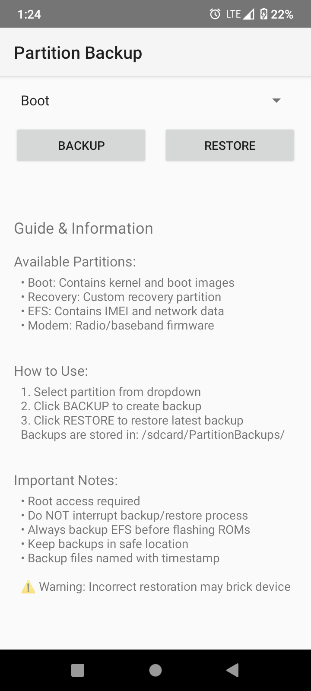
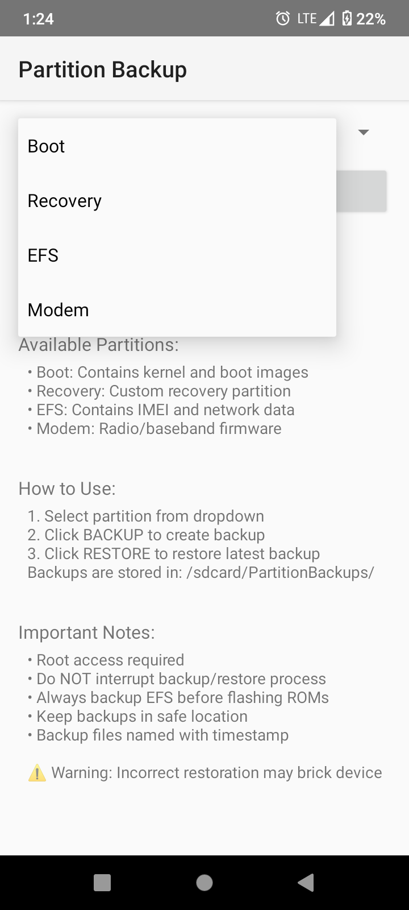
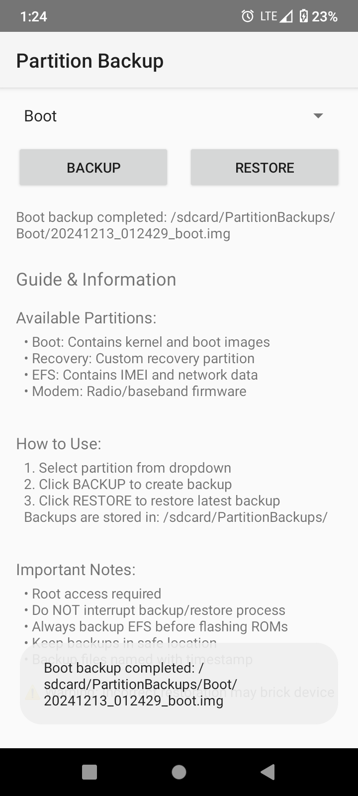

# Partition Backup
A robust Android application for backing up and restoring critical system partitions directly from your device without needing to boot into recovery mode.

## Features
- Direct backup and restore of system partitions while in Android
- Supports critical partitions:
  - Boot (kernel and boot images)
  - Recovery (custom recovery partition)
  - EFS (IMEI and network data)
  - Modem (Radio/baseband firmware)

- Automatic timestamp-based backup naming
- Simple, user-friendly interface
- No recovery mode required
- Root access verification
- Comprehensive error handling
- Real-time backup/restore status updates

## How It Works
The app utilizes root access to directly read from and write to partition blocks using the `dd` command. This allows for:
- Direct partition access without recovery mode
- Bit-perfect backups of system partitions
- Safe restoration process with verification
- Multiple backup paths support for different device configurations

## Requirements
- Rooted Android device
- Android 6.0 (Marshmallow) or higher
- Storage permission for backup storage
- Minimum 1GB free storage space recommended

## Installation
1. Download the latest APK from the releases section
2. Install the APK on your rooted device
3. Grant root access when prompted
4. Grant storage permissions when requested

## Usage
1. Select desired partition from the dropdown menu
2. Choose action:
   - **Backup**: Creates a timestamped backup in `/sdcard/PartitionBackups/`
   - **Restore**: Restores the most recent backup of selected partition

## Safety Features
- Automatic partition path detection
- Backup verification before restoration
- Fail-safe mechanisms for interrupted operations
- Read/write verification
- Backup integrity checking

## Warning
⚠️ This app deals with critical system partitions. Incorrect usage can lead to a bricked device. Always:
- Keep backups in a safe location
- Verify backup integrity
- Be especially careful with EFS partition
- Do not interrupt backup/restore process

## Compatibility
The app is designed to work with most rooted Android devices. It includes multiple partition paths for various device configurations:
/dev/block/bootdevice/by-name/
/dev/block/platform/*/by-name/
/dev/block/by-name/

## Technical Details
- Backups are stored in `/sdcard/PartitionBackups/[PartitionName]/`
- Filename format: `[TIMESTAMP]_[partition].img`
- Uses direct block-level operations via `dd` command
- Implements fallback methods for different device configurations
- Handles both MTD and eMMC devices

## Contributing
Contributions are welcome! Please feel free to submit a Pull Request. For major changes, please open an issue first to discuss what you would like to change.

## License
[MIT License]

## Disclaimer
This app requires root access and modifies system partitions. Use at your own risk. Always maintain proper backups before using this tool.

## Support
For issues, feature requests, or questions, please open an issue in this repository.

## Credits
Developed by Ingsha Sawaden/ingsha09
